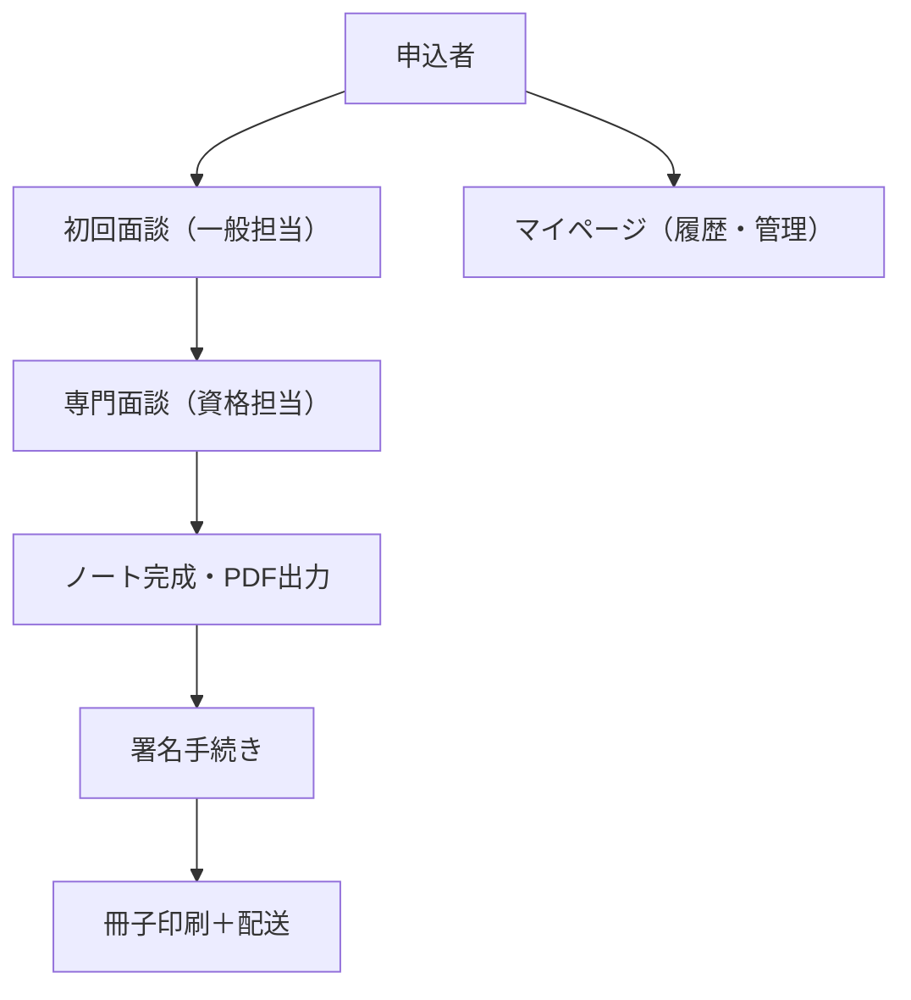

# 2_sample

test2

## table sample

| カテゴリ       | 機能                                              | 説明                                     |
|:---------------|:--------------------------------------------------|:-----------------------------------------|
| 入力支援       | セクション型フォーム＋AIアシスト                  | 負荷軽減と記録精度向上                   |
| 出力機能       | リアルタイムPDFプレビュー＋ダウンロード＋冊子印刷 | 完成形の視覚化・保存性向上               |
| リレー支援機能 | 複数コンシェルジュによる分担支援                  | 資格者が引き継ぎながら記録完成をサポート |
| ロール制御機能 | 専門資格に応じた入力／編集権限管理                | 品質と信頼性の確保                       |

## mermaid sample

